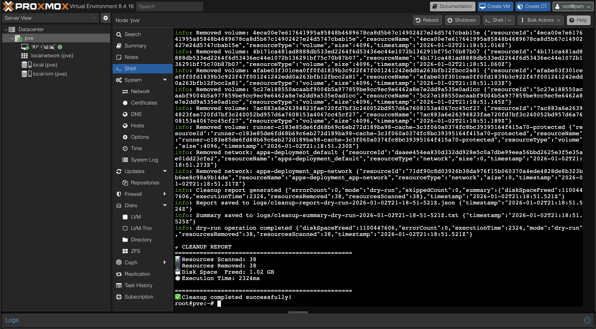
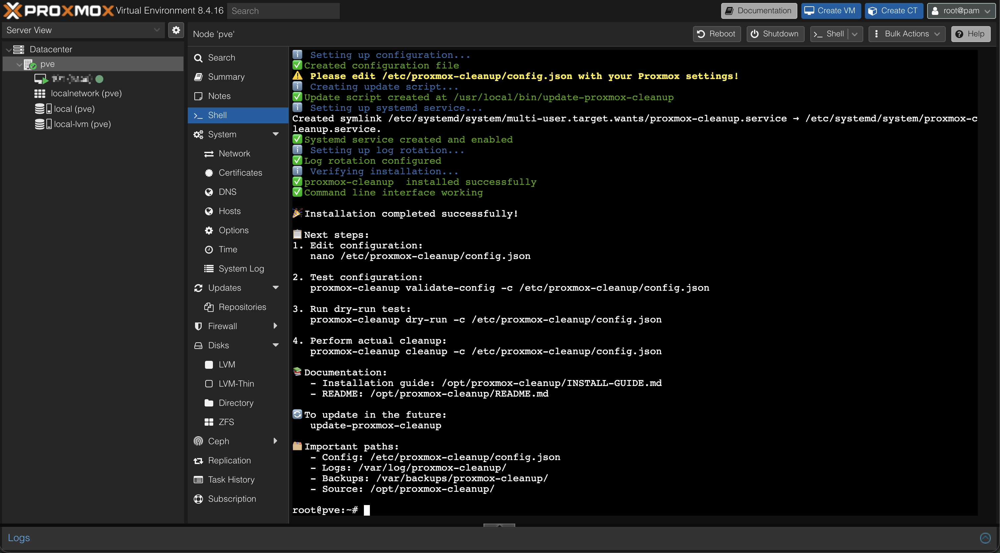

# 🧹 Proxmox Cleanup Tool

<div align="center">

[](https://github.com/hiall-fyi/proxmox-cleanup)
[](https://www.typescriptlang.org/)
[](LICENSE)
[](https://www.docker.com/)

**Automated cleanup tool for unused Docker resources on Proxmox VE infrastructure**

🚀 **One-line installation**: 
```bash
curl -fsSL https://raw.githubusercontent.com/hiall-fyi/proxmox-cleanup/main/scripts/install.sh | bash
```

---

### 🎯 Created by [@hiall-fyi](https://github.com/hiall-fyi)

<a href="https://buymeacoffee.com/hiallfyi" target="_blank">
  
</a>

*If this tool saves you time and disk space, consider buying me a coffee! ☕*

</div>

## 🎯 Features

- 🔄 **Automated Docker cleanup** - Remove unused containers, images, volumes, and networks
- 🛡️ **Safe & Smart** - Backup before cleanup, dry-run mode, resource protection
- ⚡ **Production Ready** - 157 tests, comprehensive error handling, logging
- 🎯 **Proxmox Optimized** - Designed specifically for Proxmox VE environments
- 📅 **Scheduled Cleanup** - Set it and forget it with cron scheduling
- 🔔 **Notifications** - Webhook notifications for cleanup results
- 🐳 **Docker Resource Management** - Automatically identifies and removes unused containers, images, volumes, and networks
- 💾 **Backup System** - Automatic backup of resource metadata before cleanup
- 📊 **Comprehensive Reporting** - Detailed reports with disk space calculations and execution metrics
- 🖥️ **CLI Interface** - Full-featured command-line interface with multiple commands
- 🧪 **Property-Based Testing** - Comprehensive test suite with 100+ iterations per property
- ⏰ **Scheduling** - Automated cleanup with cron expressions
- 🛡️ **Safety First** - Protected resource patterns, dependency checking, and dry-run mode

### 📸 Real-World Results

Here's what proxmox-cleanup found and cleaned on a production Proxmox VE server:


*Screenshot showing actual cleanup results: 38 resources scanned, 1.02 GB freed*

**Results Summary:**

- 📊 **Resources Scanned**: 38 unused Docker resources
- 🗑️ **Resources Cleaned**: 38 items (100% success rate)
- 💾 **Disk Space Freed**: 1.02 GB
- ⏱️ **Execution Time**: 2.3 seconds
- 🛡️ **Safety**: All operations logged and backed up

The tool successfully identified and cleaned:

- Unused Docker volumes (including large GitLab data: 512MB)
- Orphaned runner cache volumes (367MB+ total)
- Unused Docker networks
- Various temporary volumes and build artifacts

## 📋 Prerequisites

- Node.js 18+ and npm
- Docker daemon running
- Proxmox VE (optional, for Proxmox integration)

## 🚀 Quick Start

### One-Line Installation

```bash
curl -fsSL https://raw.githubusercontent.com/hiall-fyi/proxmox-cleanup/main/scripts/install.sh | bash
```

The installation script will automatically:

- Install Node.js and dependencies
- Build the project
- Set up global CLI command
- Create configuration files
- Set up systemd service
- Configure log rotation


*Screenshot showing successful installation with all components properly configured*

### Basic Usage

```bash
# 1. Configure
nano /etc/proxmox-cleanup/config.json

# 2. Test (Dry Run)
proxmox-cleanup dry-run -c /etc/proxmox-cleanup/config.json

# 3. Clean Up
proxmox-cleanup cleanup -c /etc/proxmox-cleanup/config.json
```

## 🔧 Installation Methods

### Install from Source

```bash
git clone https://github.com/hiall-fyi/proxmox-cleanup.git
cd proxmox-cleanup
npm install
npm run build
```

### Global Installation

```bash
npm install -g proxmox-cleanup
```

## 🔧 Configuration

### Configuration File

Create a `config.json` file (see `config.example.json`):

```json
{
  "proxmox": {
    "host": "proxmox.example.com",
    "token": "root@pam:your-api-token",
    "nodeId": "node1"
  },
  "cleanup": {
    "dryRun": false,
    "resourceTypes": [],
    "protectedPatterns": ["important-*", "system-*"],
    "backupEnabled": true,
    "backupPath": "./backups"
  },
  "reporting": {
    "verbose": true,
    "logPath": "./logs"
  },
  "scheduling": {
    "enabled": false,
    "cronExpression": "0 2 * * *",
    "dryRun": true,
    "timezone": "UTC"
  },
  "notifications": {
    "enabled": false,
    "onSuccess": true,
    "onFailure": true,
    "webhookUrl": "https://your-webhook.com"
  }
}
```

### CLI Options

All configuration options can be overridden via CLI:

```bash
proxmox-cleanup cleanup \
  --config ./config.json \
  --types containers,images \
  --protect "important-*,system-*" \
  --backup-path ./custom-backups \
  --verbose \
  --proxmox-host proxmox.local \
  --proxmox-token "root@pam:token"
```

## 📚 CLI Commands Reference

### `cleanup`

Execute cleanup of unused Docker resources.

```bash
proxmox-cleanup cleanup [options]

Options:
  -d, --dry-run                    Preview without removing
  -t, --types <types>              Resource types (containers,images,volumes,networks)
  -p, --protect <patterns>         Protection patterns (wildcards supported)
  -b, --backup                     Create backup (default: true)
  --no-backup                      Disable backup
  --backup-path <path>             Custom backup directory
  -c, --config <path>              Configuration file path
  -v, --verbose                    Enable verbose logging
  --proxmox-host <host>            Proxmox host address
  --proxmox-token <token>          Proxmox API token
  --proxmox-node <node>            Proxmox node ID
```

### `dry-run`

Preview what would be removed without making changes.

```bash
proxmox-cleanup dry-run [options]
```

### `list`

List unused Docker resources without removing them.

```bash
proxmox-cleanup list [options]

Options:
  --sort-by-size                   Sort by size (largest first)
```

### `validate-config`

Validate configuration file and test connections.

```bash
proxmox-cleanup validate-config [options]

Options:
  -c, --config <path>              Configuration file to validate
```

## 📖 Usage Examples

### Dry Run (Preview Mode)

```bash
# Preview what would be removed
proxmox-cleanup dry-run

# Preview specific resource types
proxmox-cleanup dry-run --types containers,images
```

### Actual Cleanup

```bash
# Clean all unused resources with backup
proxmox-cleanup cleanup

# Clean specific types without backup
proxmox-cleanup cleanup --types volumes --no-backup
```

### List Unused Resources

```bash
# List all unused resources
proxmox-cleanup list

# List specific types sorted by size
proxmox-cleanup list --types images --sort-by-size
```

## 📊 Advanced Topics

### Resource Types

- **containers**: Stopped or exited containers
- **images**: Images not used by any container
- **volumes**: Volumes not mounted by any container
- **networks**: Networks with no connected containers (excluding defaults)

### Protection Patterns

Protect resources from cleanup using patterns:

- **Wildcards**: `important-*`, `*-production`, `*-system-*`
- **Exact names**: `my-important-container`
- **Tags**: Resources with specific tags
- **IDs**: Exact resource IDs

### Backup System

Before cleanup, the system creates backups containing:

- Resource metadata (names, IDs, sizes, creation dates)
- Dependency information
- Timestamp and system information
- JSON format for easy parsing

Backup files are stored in the configured backup directory with timestamps.

### Scheduling & Automation

Automate cleanup with cron expressions:

```json
{
  "scheduling": {
    "enabled": true,
    "cronExpression": "0 2 * * *",  // Daily at 2 AM
    "dryRun": false,
    "timezone": "UTC"
  }
}
```

Common cron patterns:

- `0 2 * * *` - Daily at 2 AM
- `0 */6 * * *` - Every 6 hours
- `0 0 * * 0` - Weekly on Sunday
- `0 0 1 * *` - Monthly on 1st

### Notifications

Get notified about cleanup results:

**Webhook Notifications**

```json
{
  "notifications": {
    "enabled": true,
    "webhookUrl": "https://your-webhook.com/cleanup",
    "onSuccess": true,
    "onFailure": true
  }
}
```

**Email & Slack (Placeholder)**

Email and Slack integrations are implemented as placeholders. Extend the `NotificationService` class to add actual implementations.

### Safety Features

**Dependency Checking**

- Containers using images are protected
- Volumes mounted by containers are protected
- Networks with connected containers are protected
- Stopped containers with restart policies are protected

**Protected Resources**

- System networks (bridge, host, none)
- Resources matching protection patterns
- Resources with specific tags or IDs

**Dry-Run Mode**

- Preview all operations without making changes
- Identical results across multiple runs
- Safe for testing and validation

### Reporting & Monitoring

**Summary Reports**

```text
🧹 CLEANUP REPORT
==================================================
📊 Resources Scanned: 25
🗑️ Resources Removed: 12
💾 Disk Space Freed: 2.5 GB
⏱️ Execution Time: 1500ms
==================================================
```

**Detailed Reports**

- JSON reports with full resource details
- Text summaries for human reading
- Execution logs with timestamps
- Success/failure rates

## 🐛 Troubleshooting

### Common Issues

**Docker daemon not running**
```bash
# Check Docker status
systemctl status docker

# Start Docker
systemctl start docker
```

**Permission denied errors**
```bash
# Add user to docker group
sudo usermod -aG docker $USER

# Re-login or run
newgrp docker
```

**Configuration validation failed**
```bash
# Validate config file
proxmox-cleanup validate-config -c /etc/proxmox-cleanup/config.json

# Check logs
tail -f /var/log/proxmox-cleanup/cleanup.log
```

### Debug Mode

Enable verbose logging for troubleshooting:

```bash
proxmox-cleanup cleanup --verbose -c /etc/proxmox-cleanup/config.json
```

## 📊 Performance & Architecture

### Performance Characteristics

- Parallel resource scanning
- Efficient dependency checking
- Minimal memory footprint
- Optimized for large resource sets

### Architecture Overview

```text
proxmox-cleanup/
├── src/
│   ├── types/           # TypeScript type definitions
│   ├── interfaces/      # Interface contracts
│   ├── clients/         # Docker & Proxmox API clients
│   ├── scanners/        # Resource scanning logic
│   ├── utils/           # Utility functions
│   ├── managers/        # Backup management
│   ├── reporters/       # Report generation
│   ├── schedulers/      # Cron scheduling
│   ├── services/        # Notification services
│   ├── orchestrators/   # Main workflow coordination
│   └── cli/             # Command-line interface
├── config.example.json  # Example configuration
└── README.md           # This file
```

### Testing Strategy

**Property-Based Testing**

Uses `fast-check` to test universal properties with 100+ random inputs:

- Resource identification completeness
- Safe removal guarantee
- Backup completeness
- Size calculation accuracy
- Report consistency

**Unit Testing**

Comprehensive unit tests for all components:

- API clients with mocked responses
- Resource scanning with various scenarios
- Error handling and edge cases
- CLI argument parsing

### Security Features

- No sensitive data in logs
- Secure token handling
- Input validation and sanitization
- Principle of least privilege

### Error Handling

- Graceful handling of Docker daemon failures
- Network error recovery with exponential backoff
- Partial cleanup continuation on individual failures
- Comprehensive error logging and reporting

### Development Commands

```bash
# Build
npm run build

# Run all tests
npm test

# Run with coverage
npm run test:coverage

# Watch mode
npm run test:watch

# Linting
npm run lint
```

## 📚 Resources

- [Docker Documentation](https://docs.docker.com/)
- [Proxmox VE Documentation](https://pve.proxmox.com/wiki/Main_Page)
- [TypeScript Documentation](https://www.typescriptlang.org/docs/)
- [fast-check Property Testing](https://github.com/dubzzz/fast-check)

## 🆘 Support

For issues and questions:

1. Check the [documentation](#-features)
2. Run `proxmox-cleanup validate-config` to test setup
3. Use `--verbose` flag for detailed logging
4. Check logs in the configured log directory
5. Open an issue on [GitHub](https://github.com/hiall-fyi/proxmox-cleanup/issues)

## 📄 License

MIT License - see LICENSE file for details.

## 🤝 Contributing

1. Fork the repository
2. Create a feature branch
3. Add tests for new functionality
4. Ensure all tests pass
5. Submit a pull request

---

## ⭐ Star History

If you find this tool useful, please consider giving it a star!

[](https://star-history.com/#hiall-fyi/proxmox-cleanup&Date)

---

<div align="center">

### 💖 Support This Project

If this tool saved you time and disk space, consider buying me a coffee!

[](https://buymeacoffee.com/hiallfyi)

**Made with ❤️ by [@hiall-fyi](https://github.com/hiall-fyi)**

</div>

---

**Version**: 1.0.0  
**Last Updated**: 2025-01-04  
**Tested On**: Proxmox VE 8.x with Docker 24.x

## Changelog

See `CHANGELOG.md` for version history and changes.


