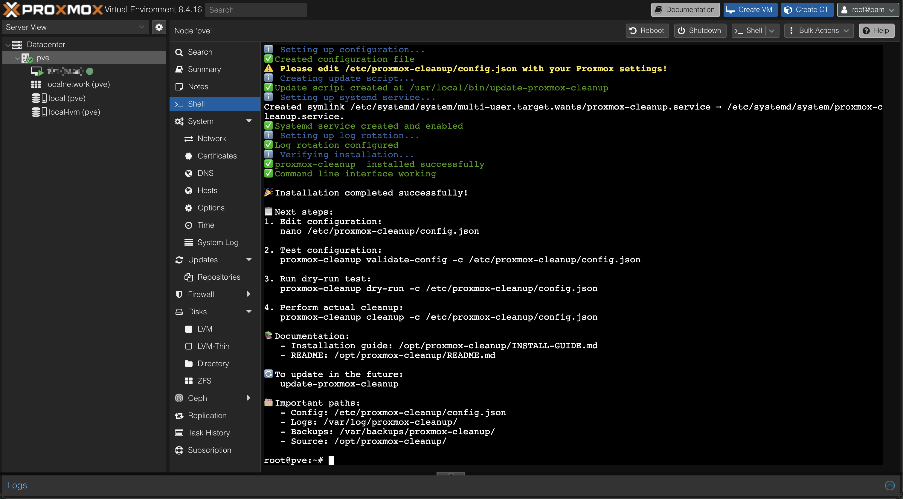
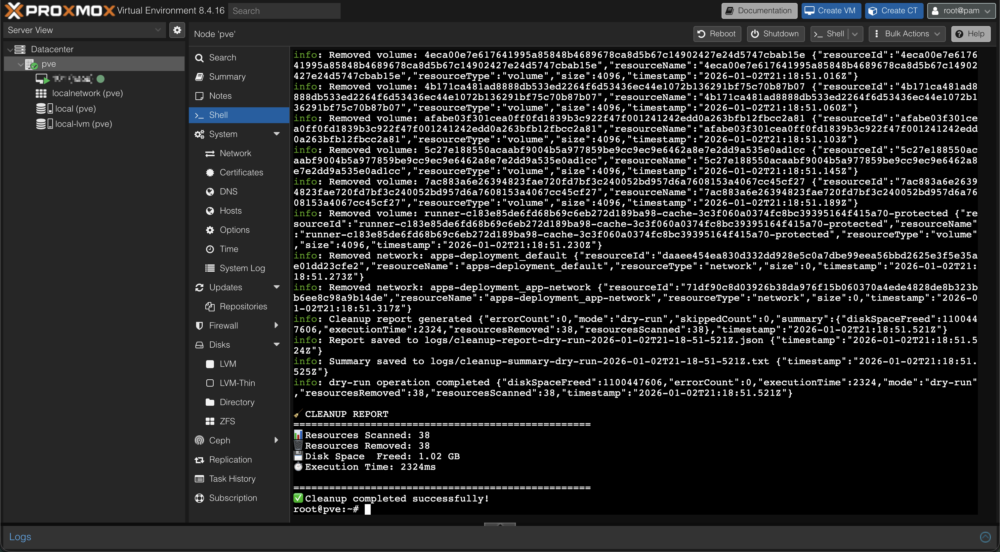

# Proxmox Cleanup — Automated Docker Resource Cleanup for Proxmox VE

<div align="center">

<!-- Platform Badges -->
   

<!-- Status Badges -->
  

<!-- Community Badges -->
   

<!-- Support -->
[](https://buymeacoffee.com/hiallfyi)

**🧹 One command to find and remove unused Docker containers, images, volumes, and networks on your Proxmox host.**

**Dry-run first, backup automatically, protect what matters. Install once, schedule with cron, and forget about it.**

[Quick Start](#quick-start) • [Features](#features) • [Configuration](#configuration) • [CLI Reference](#cli-commands-reference) • [Troubleshooting](#troubleshooting)

</div>

---

## Why Proxmox Cleanup?

Running Docker on a Proxmox host tends to leave behind unused containers, images, volumes, and networks — quietly eating disk space. Proxmox Cleanup finds and removes them, with a few safety nets: backups before anything is deleted, a dry-run you can preview first, protection patterns for the things you want to keep, and dependency checks so nothing in use gets touched.

One-line install, schedule it with cron, then forget about it.

---

## Quick Start

**Prerequisites:** Node.js 18+, npm, Docker daemon running, Proxmox VE (optional for Proxmox integration).

### 1. Install

```bash
curl -fsSL https://raw.githubusercontent.com/hiall-fyi/proxmox-cleanup/main/scripts/install.sh | bash
```

The installer handles Node.js dependencies, build, global CLI setup, systemd service, config files, and log rotation.


*Successful installation with all components configured*

<details>
<summary>Install from Source</summary>

```bash
git clone https://github.com/hiall-fyi/proxmox-cleanup.git
cd proxmox-cleanup
npm install
npm run build
```
</details>

<details>
<summary>Global npm Install</summary>

```bash
npm install -g proxmox-cleanup
```
</details>

### 2. Configure

```bash
nano /etc/proxmox-cleanup/config.json
```

### 3. Test (Dry Run)

```bash
proxmox-cleanup dry-run -c /etc/proxmox-cleanup/config.json
```

### 4. Clean Up

```bash
proxmox-cleanup cleanup -c /etc/proxmox-cleanup/config.json
```

### 5. Verify


*Real-world results: 38 resources scanned, 1.02 GB freed in 2.3 seconds*

---

## Features

- **Automated Docker cleanup** — remove unused containers, images, volumes, and networks in one command
- **Safety first** — backup before cleanup, dry-run mode, protected resource patterns, dependency checking
- **Well tested** — property-based tests with `fast-check`, structured logging, explicit error reporting
- **Proxmox VE friendly** — tested on Proxmox VE 8.x running Docker on the host
- **Scheduled runs via systemd or cron** — the installer registers a systemd unit you can drive from a timer or system cron
- **Readable reports** — disk space freed, execution time, what was kept or skipped and why
- **CLI with the common commands you'd expect** — `cleanup`, `dry-run`, `list`, `validate-config`, plus the usual flags

### Resource Types

| Type | What Gets Cleaned |
|------|-------------------|
| containers | Stopped or exited containers |
| images | Images not used by any container |
| volumes | Volumes not mounted by any container |
| networks | Networks with no connected containers (excluding defaults) |

### Safety Features

- **Dependency Checking** — Containers using images, volumes mounted by containers, and networks with connections are all protected
- **Protected Resources** — System networks (bridge, host, none), resources matching protection patterns, tagged resources
- **Backup System** — Automatic backup of resource metadata (names, IDs, sizes, dependencies) before cleanup
- **Dry-Run Mode** — Preview all operations without making changes; identical results across multiple runs

---

## Configuration

Create a `config.json` file (see `config.example.json`):

```json
{
  "proxmox": {
    "host": "proxmox.example.com",
    "token": "root@pam:your-api-token"
  },
  "cleanup": {
    "dryRun": false,
    "resourceTypes": [],
    "protectedPatterns": ["important-*", "system-*"],
    "backupEnabled": true,
    "backupPath": "./backups",
    "minAge": "7d"
  },
  "reporting": {
    "verbose": true,
    "logPath": "./logs"
  }
}
```

All configuration options can be overridden via CLI flags.

**Age filtering:** The optional `minAge` setting (or `--older-than` CLI flag) accepts a duration like `7d` (7 days), `12h` (12 hours), `30m` (30 minutes). Only resources older than this are removed — age is how long ago the resource was *created*, not last-used. Accepted units: `s` (seconds), `m` (minutes), `h` (hours), `d` (days), `w` (weeks).

**Volumes and creation time:** Docker volumes often report no creation time. When a resource's creation time is unavailable, `--older-than` skips it entirely and the report shows a separate count of these skipped resources. This keeps the tool safe by default — if the Engine can't tell you when a volume was created, the age filter won't guess.

### Scheduling

The installer registers `proxmox-cleanup.service` as a systemd unit. Drive it from a systemd timer or regular cron:

```ini
# /etc/systemd/system/proxmox-cleanup.timer
[Unit]
Description=Run Proxmox Cleanup daily

[Timer]
OnCalendar=*-*-* 02:00:00
Persistent=true

[Install]
WantedBy=timers.target
```

```bash
systemctl enable --now proxmox-cleanup.timer
```

| Pattern | Schedule |
|---------|----------|
| `0 2 * * *` | Daily at 2 AM |
| `0 */6 * * *` | Every 6 hours |
| `0 0 * * 0` | Weekly on Sunday |
| `0 0 1 * *` | Monthly on 1st |

### Protection Patterns

Protect resources from cleanup using patterns:

- **Wildcards**: `important-*`, `*-production`, `*-system-*`
- **Exact names**: `my-important-container`
- **Tags**: Resources with specific tags
- **IDs**: Exact resource IDs

---

## CLI Commands Reference

### `cleanup`

Execute cleanup of unused Docker resources.

```bash
proxmox-cleanup cleanup [options]

Options:
  -d, --dry-run                    Preview without removing
  -t, --types <types>              Resource types (containers,images,volumes,networks)
  -p, --protect <patterns>         Protection patterns (wildcards supported)
  -b, --backup                     Create backup (default: true)
  --no-backup                      Disable backup
  --backup-path <path>             Custom backup directory
  -c, --config <path>              Configuration file path
  -v, --verbose                    Enable verbose logging
  --proxmox-host <host>            Proxmox host address
  --proxmox-token <token>          Proxmox API token
  --older-than <duration>          Only remove resources older than this (e.g. 7d, 12h)
  --json                           Output JSON only (suppresses human-readable output)
```

### `dry-run`

Preview what would be removed without making changes.

```bash
proxmox-cleanup dry-run [options]

Options:
  -t, --types <types>              Resource types to scan (containers,images,volumes,networks)
  -p, --protect <patterns>         Protection patterns (wildcards supported)
  -c, --config <path>              Path to configuration file
  -v, --verbose                    Enable verbose logging
  --log-path <path>                Custom log directory path
  --proxmox-host <host>            Proxmox host address
  --proxmox-token <token>          Proxmox API token
  --older-than <duration>          Only remove resources older than this (e.g. 7d, 12h)
  --json                           Output JSON only (suppresses human-readable output)
```

### `list`

List unused Docker resources without removing them. Results are grouped by type and sorted largest-first.

```bash
proxmox-cleanup list [options]

Options:
  -t, --types <types>              Resource types to list (containers,images,volumes,networks)
  -p, --protect <patterns>         Protection patterns (wildcards supported)
  -c, --config <path>              Path to configuration file
  --older-than <duration>          Only list resources older than this (e.g. 7d, 12h)
  --json                           Output JSON only (suppresses human-readable output)
```

### `validate-config`

Validate configuration file and test connections.

```bash
proxmox-cleanup validate-config -c /etc/proxmox-cleanup/config.json

Options:
  -c, --config <path>              Path to configuration file
  --json                           Output JSON only (suppresses human-readable output)
```

---

## Usage Examples

```bash
# Preview what would be removed
proxmox-cleanup dry-run

# Preview specific resource types
proxmox-cleanup dry-run --types containers,images

# Clean all unused resources with backup
proxmox-cleanup cleanup

# Clean specific types without backup
proxmox-cleanup cleanup --types volumes --no-backup

# List all unused resources (sorted largest-first)
proxmox-cleanup list

# Only clean resources created more than 7 days ago
proxmox-cleanup cleanup --older-than 7d

# Machine-readable JSON output for scripting
proxmox-cleanup list --json > unused-resources.json

# Verbose mode for troubleshooting
proxmox-cleanup cleanup --verbose -c /etc/proxmox-cleanup/config.json
```

---

## Architecture

```text
proxmox-cleanup/
├── src/
│   ├── types/           # TypeScript type definitions
│   ├── interfaces/      # Interface contracts
│   ├── clients/         # Docker & Proxmox API clients
│   ├── scanners/        # Resource scanning logic
│   ├── utils/           # Utility functions
│   ├── managers/        # Backup management
│   ├── reporters/       # Report generation
│   ├── orchestrators/   # Main workflow coordination
│   └── cli/             # Command-line interface
├── config.example.json  # Example configuration
└── README.md
```

### Testing

Property-based testing with `fast-check` (100+ random inputs per property) covering resource identification, safe removal guarantees, backup completeness, size calculation accuracy, and report consistency. Plus unit tests for every component.

```bash
npm test              # Run the full suite
npm run test:coverage # Run with coverage
npm run build         # Build
npm run lint          # Linting
```

---

## Troubleshooting

<details>
<summary>Docker daemon not running</summary>

```bash
systemctl status docker
systemctl start docker
```
</details>

<details>
<summary>Permission denied errors</summary>

```bash
sudo usermod -aG docker $USER
newgrp docker
```
</details>

<details>
<summary>Configuration validation failed</summary>

```bash
proxmox-cleanup validate-config -c /etc/proxmox-cleanup/config.json
tail -f /var/log/proxmox-cleanup/cleanup.log
```
</details>

For other issues, use `--verbose` flag for detailed logging, check logs in the configured log directory, or [open an issue on GitHub](https://github.com/hiall-fyi/proxmox-cleanup/issues).

---

## Resources

- [Docker Documentation](https://docs.docker.com/)
- [Proxmox VE Documentation](https://pve.proxmox.com/wiki/Main_Page)
- [TypeScript Documentation](https://www.typescriptlang.org/docs/)
- [fast-check Property Testing](https://github.com/dubzzz/fast-check)

---

## License

**MIT License** — Free to use, modify, and distribute. See [LICENSE](LICENSE) for full details.

**Made with ❤️ by Joe Yiu ([@hiall-fyi](https://github.com/hiall-fyi))**

---

## Contributing

Contributions welcome!

1. Fork the repository
2. Create feature branch (`git checkout -b feature/AmazingFeature`)
3. Commit changes (`git commit -m 'Add AmazingFeature'`)
4. Push to branch (`git push origin feature/AmazingFeature`)
5. Open a Pull Request

---

<div align="center">

[](https://star-history.com/#hiall-fyi/proxmox-cleanup&Date)

</div>

---

<details>
<summary>Disclaimer</summary>

This project is not affiliated with, endorsed by, or connected to Proxmox Server Solutions GmbH or Docker, Inc. Proxmox and the Proxmox logo are registered trademarks of Proxmox Server Solutions GmbH. Docker and the Docker logo are registered trademarks of Docker, Inc. All product names, logos, and brands are property of their respective owners.

This tool is provided "as is" without warranty of any kind. Use at your own risk.

</details>

---

See [CHANGELOG.md](CHANGELOG.md) for version history.
